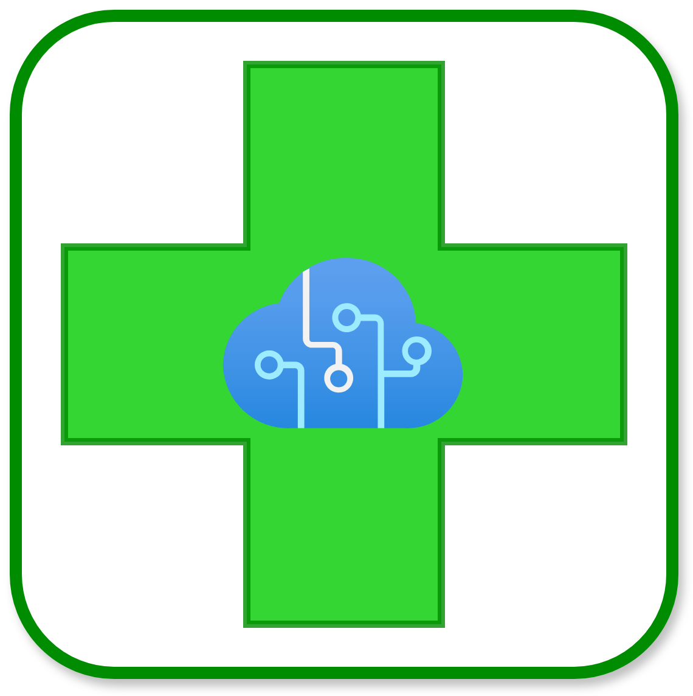

# AI Pharmacist Assistant

### Introduction and Motivation

    

Welcome to the documentation of our virtual pharmacy assistant. This chatbot was developed to improve the efficiency of stock management and to provide quick and precise support to pharmacists. The motivation behind this project stems from the need to optimise the processes of searching for and distributing medicines, reducing waiting times and increasing customer satisfaction.

One of the main strengths of our virtual assistant is its ability to recommend targeted medication for each patient. Based on the physical characteristics and specific symptoms of each customer, the chatbot avoids suggesting generic drugs, instead ensuring personalised and accurate advice. This approach ensures more effective treatment and greater attention to patients' individual needs.

In addition, interaction with the chatbot takes place through natural language, making it extremely intuitive and accessible. No computer skills or special training are required to use our virtual assistant. This makes the system easy to integrate into the daily workflow of any pharmacy, enhancing the experience for both pharmacists and customers.

Thanks to its advanced functionality for collecting and analysing sales statistics, the chatbot enables more informed and strategic stock management, further contributing to the operational efficiency of the pharmacy.

